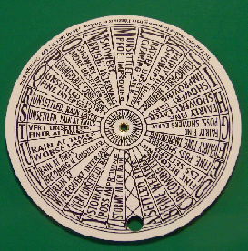

# WeatherCheckingRpi
Project where humidity, pressure and temperature are mesured with a Raspberry Pi 3 and BME280 environmental sensor. Provide a graphical interface displaying these metrics.
The interface provides a weather icon corresponding to the current weather.

# Source repository
- The weathercheckingrpi folder contains a modified version of the Qt creator example weatherinfo project also included in the git repository (WeatherCheckingRpi) untouched.\n
- weathercheckingrpi contains source of the product in developement for the AJC training.
