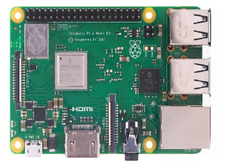

# WeatherCheckingRpi
Project where humidity, pressure and temperature are mesured with a Raspberry Pi 3 and BME280 environmental sensor. Provide a graphical interface displaying these metrics.
The interface provides a weather icon corresponding to the current weather.

